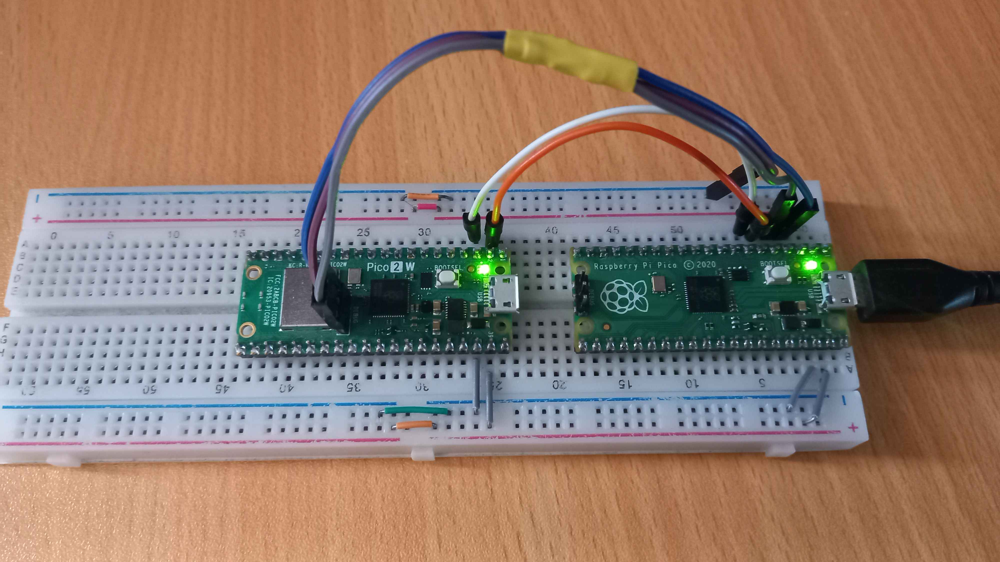

# 00-Pico_Setup

- [00-Pico\_Setup](#00-pico_setup)
  - [Project Outline](#project-outline)
  - [Project Summary](#project-summary)
  - [Related Documents](#related-documents)

## Project Outline

This project will setup the workflow to program the Pico 2 W using VScode with the C/C++ SDK.
A second Pico will be used as a debugger. The final goal will be to blink the onboard LED.

See [Project PLan](./Notes/Project_Plan.md) for more details.

## Project Summary

Example blink code was successfully uploaded to a RPi pico 2W using a second pico 1 as a debugger. A bit more info and a video can be found in the [Final Testing document](./Notes/Testing-Final.md).

Most of the project went smoothly except some of the rules needed to be set to use the debugger. This is probably because I was using Kubuntu so I had to do a bit more setup.

## Related Documents
- [Project Plan](./Notes/Project_Plan.md)
- [Resources](./Notes/Resources.md)
- [Work Log](./Notes/Work_Log-0.md)
- [Checklist](./Notes/Checklist.md)
- [Testing Documents](./Notes/Testing-Final.md)
