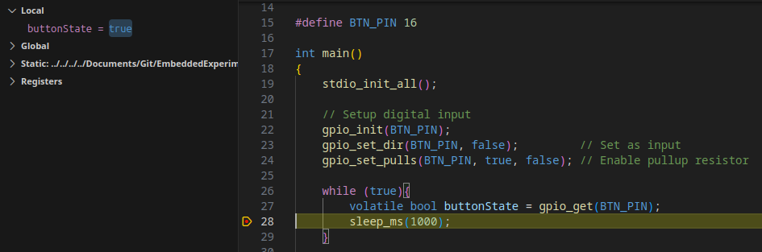
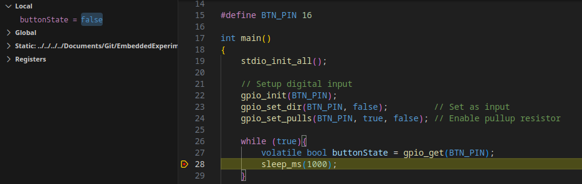
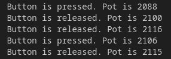

# Notes 0

## 25/10/23

### Project Setup
- I used the VSCode extension to create a new project 
- Set the board to the pico 2W and included the UART example, left everything else as default
- Didn't need to download anything this time so the project was created instantly

``` C
// Setup digital input
gpio_init(BTN_PIN);
gpio_set_dir(BTN_PIN, false);         // Set as input
gpio_set_pulls(BTN_PIN, true, false); // Enable pullup resistor

gpio_get(BTN_PIN); //Read Pin
```   
The pin can be setup an read with these commands
- Looks like there is no function that can do this all at once, I would have to make this
- Becaus the digital pin uses an internal pullup resistor, when the button is pressed the pin is read as low, and high when the button is not pressed
- This could be reversed by using a pulldown or flipping the bit that is read






Here is the pin state as seen by the debugger, The top image is when the button is not pressed. This is reading as true as expected.


## 25/10/24

### Connecting Potentiometer

- I had to add `hardware_adc` to the `target_link_libraries` section in CMakeList
- Setup an analog read using the example
- This was reading values from 0-4096 (12Bit ADC) but I noticed that the pot maxed out at about 80% of the turn
- I discovered that this was because I was using Vsys as Vcc. I thought this was 3.3V but its closer to 4V.
- I changed the pot Vcc to the 3.3V out of the pico and this fixed the problem
  
### Using UART
- I used the hello_uart.c example and connected the FTDI to uart1
- I used the pico extension terminal monitor to look at the com port
- Only `uart_puts()` would send data, `printf()` would not
- I says `printf will also output via the default UART`, I need to see if I can change this
- Had a look and didn't find an easy way to change the default 
- I did find this option in the CMake `pico_enable_stdio_uart(01-Pico_Serial_IO 1)`, Setting this to 1 allows the debugger to pass the serial data to a comm port
- I can remove the FTDI controller and just use the debugger
- I can now remove all existing uart stuff that used uart1
- This is working now and the data is being printed to the Serial Monitor


