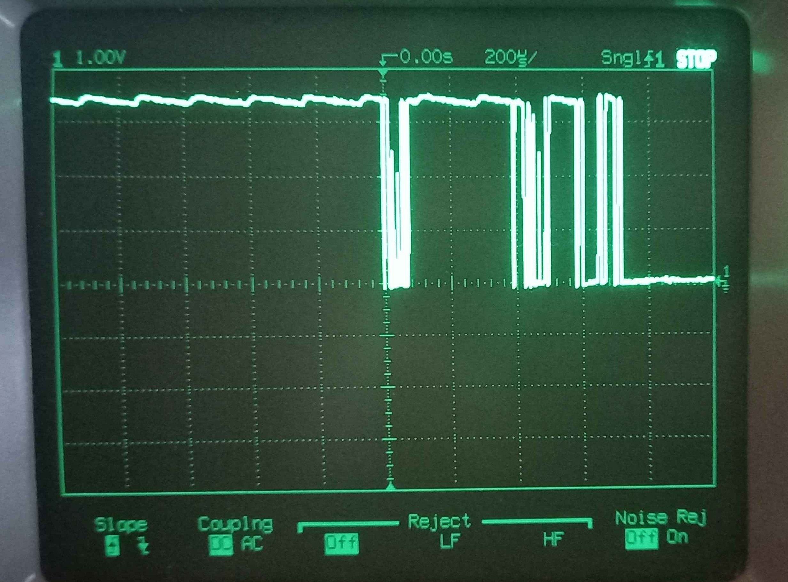
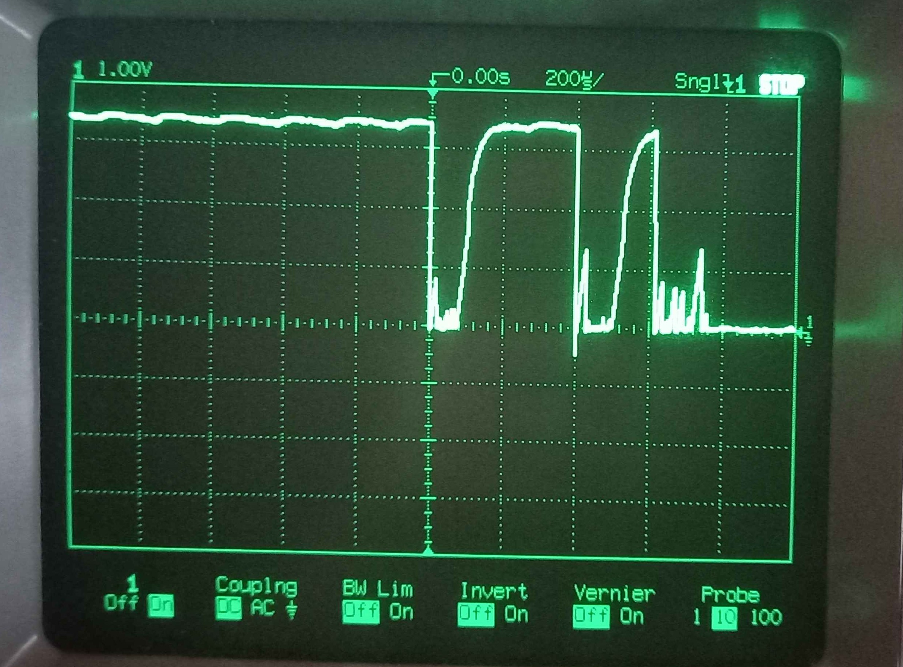

# Notes 0

## 25/10/23

### Project Setup
- I used the VSCode extension to create a new project 
- Set the board to the pico 2W and included the UART example, left everything else as default
- Didn't need to download anything this time so the project was created instantly

``` C
// Setup digital input
gpio_init(BTN_PIN);
gpio_set_dir(BTN_PIN, false);         // Set as input
gpio_set_pulls(BTN_PIN, true, false); // Enable pullup resistor

gpio_get(BTN_PIN); //Read Pin
```   
The pin can be setup an read with these commands
- Looks like there is no function that can do this all at once, I would have to make this
- Becaus the digital pin uses an internal pullup resistor, when the button is pressed the pin is read as low, and high when the button is not pressed
- This could be reversed by using a pulldown or flipping the bit that is read


Here is the pin state as seen by the debugger, The top image is when the button is not pressed. This is reading as true as expected.


## 25/10/24

### Connecting Potentiometer

- I had to add `hardware_adc` to the `target_link_libraries` section in CMakeList
- Setup an analog read using the example
- This was reading values from 0-4096 (12Bit ADC) but I noticed that the pot maxed out at about 80% of the turn
- I discovered that this was because I was using Vsys as Vcc. I thought this was 3.3V but its closer to 4V.
- I changed the pot Vcc to the 3.3V out of the pico and this fixed the problem
  
### Using UART
- I used the hello_uart.c example and connected the FTDI to uart1
- I used the pico extension terminal monitor to look at the com port
- Only `uart_puts()` would send data, `printf()` would not
- I says `printf will also output via the default UART`, I need to see if I can change this
- Had a look and didn't find an easy way to change the default 
- I did find this option in the CMake `pico_enable_stdio_uart(01-Pico_Serial_IO 1)`, Setting this to 1 allows the debugger to pass the serial data to a comm port
- I can remove the FTDI controller and just use the debugger
- I can now remove all existing uart stuff that used uart1
- This is working now and the data is being printed to the Serial Monitor


## 25/10/26
### Adding External Interrupt

- Need to attach the button to an interrupt, decided to look at the [example](https://github.com/raspberrypi/pico-examples/blob/master/gpio/hello_gpio_irq/hello_gpio_irq.c)
- Loos pretty simple, uses `gpio_set_irq_enabled_with_callback()` to attach the pin to the callback
- Want to detect on the falling edge
- Also removed the onboard LED
- Added the IRQ code, it seems to be triggering twice each time I press the button
- Don't think its bouncing, it seems too consistent, need to check the callback with the debugger
- I want to see what `uint gpio, uint32_t events)` these are, but the debugger says they are optimized out
- Disabled the optimizer using `#pragma GCC optimize ("O0")`
- When I press the button and break in the isr, `gpio = 16` and `event = 4`
- This doesn't change so maybe it is bouncing
- Checked with the scope, this confirmed it is bouncing

<table>
<tr>


</tr>
</table>

- The left picture is the noise on the button
- Right has added a 1nF capacitor, this helps reduce some noise but is not enough
- If I add more capacitance the rise time starts to get effected
- I will do a combination of a capacitor and software debouncing with a timer
- The right image is at 200us/div, so the bouncing lasts around 800us. I will have a 1ms debouncing timer
- Will look at adding a timer using an alarm callback to set a flag
- Will use `add_alarm_in_ms()`, this is safe to call in the IRQ
- A 1ms delay was not enough time, 3 mostly worked. 4ms was reliable 
- Can remove the read of the button in the IRQ as this will always be pressed
- It seems like the alarm callback is being constantly called, looks like I had to return 0 in the alarm callback otherwise it can repeat 
- I don't see any compile warning, there should be something as I did not return a value for a function which expects a int64_t return
- Looks like I can enable warning by adding `add_compile_options(-Werror -Wall -Wextra -Wnull-dereference)` in the `CMakeList.txt` file. Make sure to add it below `pico_sdk_init()`
- The compile warnings now show, it also triggers on any unused variables like in the callbacks
- And the errors are underlined with red in VSCode 
- I will disable this for now, but its good to know how to enable them
- I also tested just the software debouncing without the capacitor, and it works fine with the 4ms delay