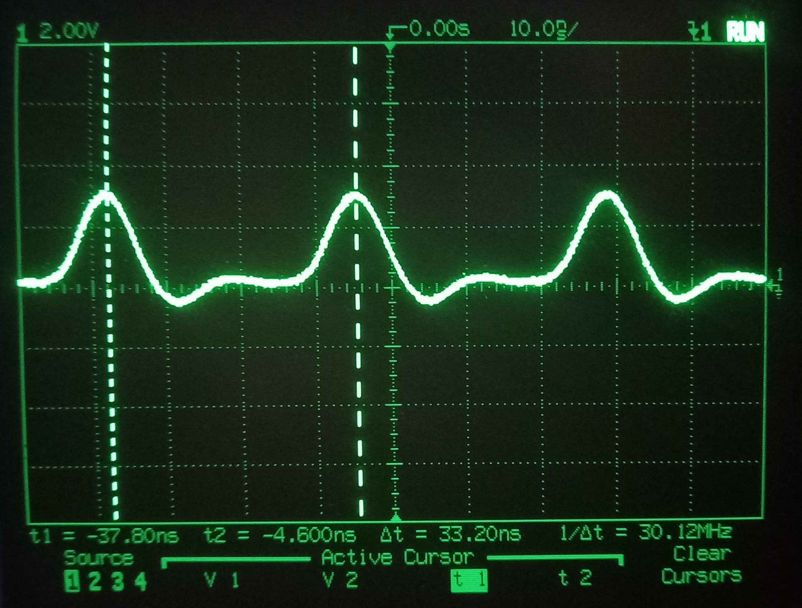
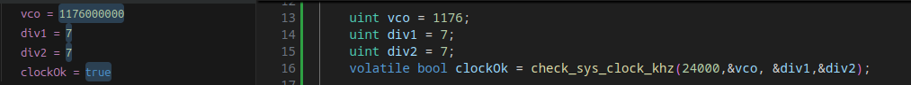
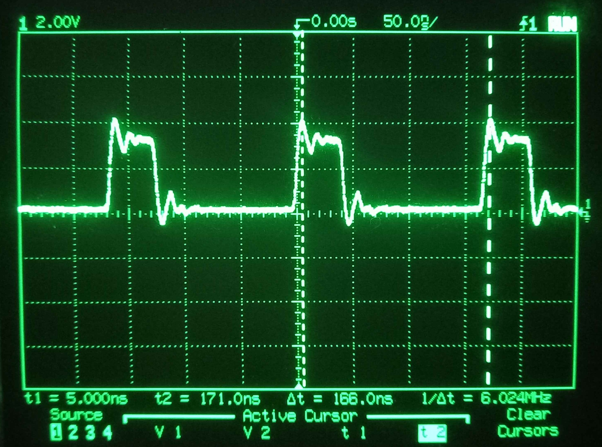
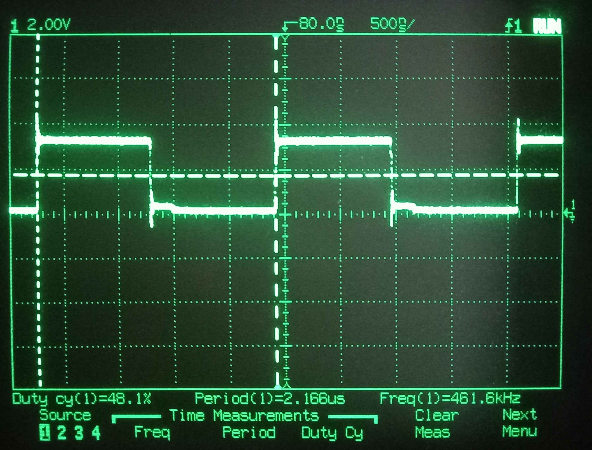

# Work Log

## 4/11/2025

### C Arm API Setup
- Will start off with the C Arm API
- Made a project found in [here](../Code/02-c_arm_api/)
- Will connect an LED to GPIO pin 16
- Using a 220Ω should give a current of 4mA
- [Section 14.9.4.1](https://datasheets.raspberrypi.com/rp2350/rp2350-datasheet.pdf#%5B%7B%22num%22%3A1342%2C%22gen%22%3A0%7D%2C%7B%22name%22%3A%22XYZ%22%7D%2C115%2C261.612%2Cnull%5D) has details on the current limit of the RP2350, looks like there is different drive strength settings
- [Here](https://www.raspberrypi.com/documentation/computers/raspberry-pi.html#gpio-pads-control) is some more documentation, looks like the pins are ok up to 16mA so I don't need to worry
- I created some simple blink code using GPIO 16
- Started with a 1s period so I could confirm visually that the LED was blinking
- I removed all delay and the LED did not appear to turn on
- I looked with the scope and there was a 3.3V 'square wave'

- This was around 30MHz and was not very square wave shaped
- My scope is 100MHz so there may be some aliasing going on, I will need to look into this further
- I will try find the clock rate and calculate what I expect the signal to be
- I will probably reduce the clock rate so I can compare the different architectures

### Lowering Clock Speed
- [Here](https://forums.raspberrypi.com/viewtopic.php?t=302191) is some info on the clock speed, look like the speed should be 130MHz
- Further testing shows that the default clock is 150MHz
- I added `set_sys_clock_khz(130000,true);` and the square wave looked the same
- I also checked the return of this function and it was true so it is being set correctly
- There is some confusing information in the api docs, it says `not all clock frequencies are possible` but no info on what is available
- It does point to a python script here `.pico-sdk/sdk/2.2.0/src/rp2_common/hardware_clocks/scripts/vcocalc.py` 
- I will look at the datasheet and have learn more about the PPL. See [section 8](https://datasheets.raspberrypi.com/rp2350/rp2350-datasheet.pdf#%5B%7B%22num%22%3A516%2C%22gen%22%3A0%7D%2C%7B%22name%22%3A%22XYZ%22%7D%2C115%2C841.89%2Cnull%5D)
- A 12MHz crystal oscillator is used
- The clock then ges through the [PLL](https://datasheets.raspberrypi.com/rp2350/rp2350-datasheet.pdf#%5B%7B%22num%22%3A578%2C%22gen%22%3A0%7D%2C%7B%22name%22%3A%22XYZ%22%7D%2C115%2C574.206%2Cnull%5D)
- The equation to calculate the system clock (FOUTPOSTDIV) is:

$$ FOUTPOSTDIV = \frac{FREF}{REFDIV} × \frac{FBDIV}{POSTDIV1 × POSTDIV2}$$
- The default setting looks to be:
$$ FOUTPOSTDIV = \frac{12}{1} × \frac{130}{6 × 2}$$
$$= 12 × \frac{130}{12}$$
$$=130MHz$$

- The function `set_sys_clock_pll()` allows me to set vco, div1 and div2
- Looks like the lowest I can easily go is 24MHz by setting vco=1176, and pd1 and 2 = 7
- I used the `check_sys_clock_khz()`  function to check if this is a valid setting and it was good

- However when running `set_sys_clock_pll()` the pico locks up, need to investigate why

## 4/11/2025
### Investigate Undercooking

- I changed the function back to `set_sys_clock_khz(24000, false);` as I know that 24000 should be possible and this is working as expected
- This is confirmed by using `frequency_count_khz()`
- Im not quite sure whats wrong with the pll function, I think I am not understanding vco_freq properly
- With the sys clock set to 24MHz, the output square wave is a lot slower anbd actually looks like a square wave
- There is a bit of ripple on the transitions but I'll ignore this for now

- The output square wave has a frequency of 6MHz, This means its taking about 4 clock cycles to set then clear the pin
- Notice the duty cycle is 25%, this means that it takes 3 times as long to set the pin as to clear it
- This is already a lot faster then I expected, as I know the `gpio_put()` function does call at least 1 other function
- Out of curiosity I disabled GCC optimizations using `#pragma GCC optimize ("O0") `
- This had a dramatic effect, with the pin frrequency dropping dramatically down to 461kHz

- Note the duty cycle is close to 50% but not quite, it looks like there is a couple cycled difference
- Next I will look at the assembly generated for both versions

