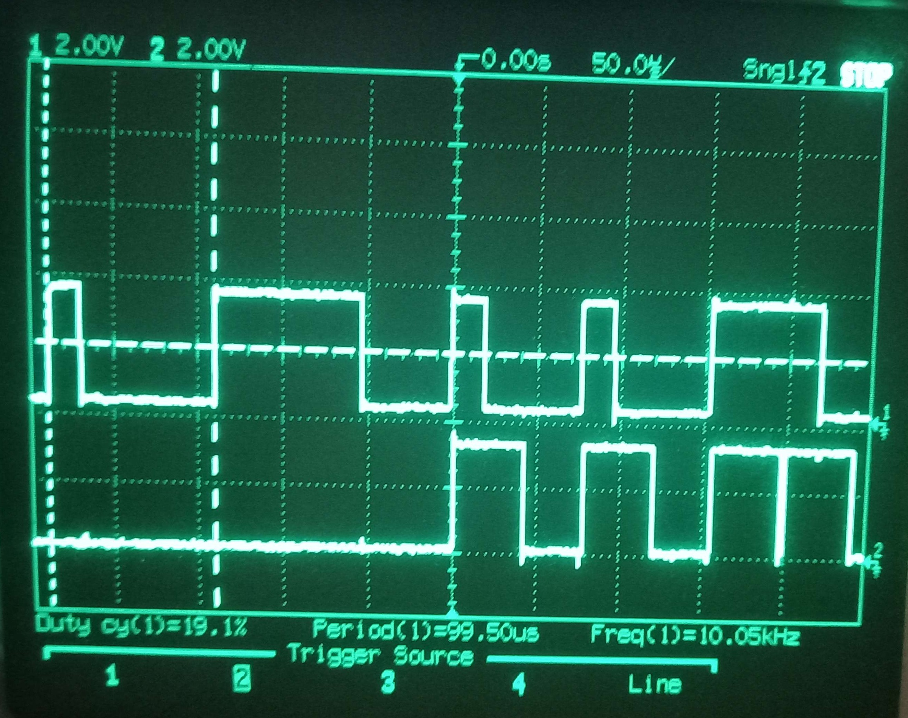

# Notes 0

## 12/12/2025

### Part Selection and Finding Datasheets

- Already have a STM32F103C8T6 so I will use that 
- Using the sensors and flash I already have
- I checked all the peripherals and they are all 3.3V compatible
- Data can be saved as raw ascii
  - This is what a line could look like `25-12-12:08-49, 23.5, 56.8`, this is 26 bytes +1 for new line
  - The flash is 32 MBit = 4 MBytes, this should be able to store around 150,000 entries  
  - At 1 entry per second this is around 2 days worth of data
  - I will use raw ascii to start off with to make it easier to debug, then I will store data as raw binary later
  - I will probably have a header at the start of the storage that points to the next free bit of data
  - I might need to batch write data
  - I should look at wear leveling 

### STM32 USB data logging

- I want to use the onboard USB port to log data
- This [guide](https://deepbluembedded.com/stm32-usb-cdc-virtual-com-port-vcp-examples/) shows how to set up the blue pill with a virtual COM port
- I will start with this and try print something to a serial port
- I had some problems with getting the cubeIDE compiling, it was complaining about some RTOS packages but I didn't need them
- This was only solved by completely removing the workspace and starting again.
- I tried the example code from the guide but I was not seeing anything in the serial port
- A common problem is some clones have the wrong D+ pullup resistor but I confirmed that there is the correct 1.5K resistor between D+ and 3.3V
- Tried some more stuff and now the device is appearing on the PC but nothing is being sent
- As UART is not needed in the final design I am just going to use a external FTDI cable
- Following this [guide](https://microcontrollerslab.com/stm32-blue-pill-uart-tutorial-polling-method/), need to use asynchronous mode and move RX and TX to B7 and B6
- I connected the FTDI converter, but I couldn't see it `/dev/ttyACM*`, but it was actually under `/dev/ttyUSB0` 
- I think I had to set the baud rate using `stty -F /dev/ttyUSB0 115200 raw -echo` 
- I can now send data using HAL_UART_Transmit()
- I tried sending data from the PC to the micro, this wasn't working because cat can only read
- I had to install screen, this worked with `screen /dev/ttyUSB0 115200`
  - Close screen with Ctrl+A  k
- I can listen to data with HAL_UART_Receive()

## 14/12/2025
### DHT11 Temperature Sensor
- [DHT11 Datasheet](https://www.mouser.com/datasheet/2/758/DHT11-Technical-Data-Sheet-Translated-Version-1143054.pdf)
- I will need some sort of timer for a timeout when waiting 
- Can use HAL_GetTick() to get the current count in milliseconds
- Now I need to look at the datasheet
- There is already a 10k pullup resistor on the data line, a 5K is recommended but this should be fine
- The sensor uses Single-bus data format
  - Will bit-bang it to start with
  - I will need to have a pin swap between input and output open drain
- Ive made some code that starts as input so the pin is pulled high by the pullup resistor
- The pin is then set as output with open drain and the pin is pulled low for 20ms
- The pin is then set back to input and the pin pulled high
- I can see the response of the DHT with the scope so this is all working correctly
- Next step is reading the data
- Here is a [guide](https://controllerstech.com/using-dht11-sensor-with-stm32/), it shows a way of reading the 1 or 0 from the response
- This is blocking but I will do this for now
- Added 3 waiting while loops to detect the first 2 80us LOW then HIGH pulse
- Then want to go into a big loop where I detect the rising edge, wait for 40us then read the pin
- If the pin is LOW then the bit is 0, else its 1

## 15/12/2025
### DHT11 Temperature Sensor Timing
- I need to delay for 40us, but only have a millisecond timer and delay
- Would like to use [DWT](https://deepbluembedded.com/stm32-delay-microsecond-millisecond-utility-dwt-delay-timer-delay/) but the STM32 im using doesn't have this
- Will have to use a timer instead, here is a better [guide](https://blog.embeddedexpert.io/?p=3323)
  - I'm on a 72MHz clock so I have to modify some fields
  - I added the done but I just getting all ones as the result
- I think there is something wrong with the timer, I will just toggle a pin see if the delay is correct
  - Tested with toggling a pin every with the microsecond delay and it works fine for a delay greater than 5us
  - Will add a second output, and have this one go high  when the low to high is detected
  - Then go low when the timer goes off
  - Noticed that the delay starts 100ms late, I think something is timing out
  - It was the debug prints that I had added that were causing all the problems
 

Here is the output on the scope with the print lines removed

- This shows the correct timing however I notice that there is a problem with last bit on the screen
  - When the bit is 1, the code needs to wait a bit because the waiting while loop detects a high and thinks it is the start
  - I will need to add an extra 40us delay after a 1 bit is read
- This is all working now, I can read all 40 bits
  - I have confirmed the first 8 with the scope
 