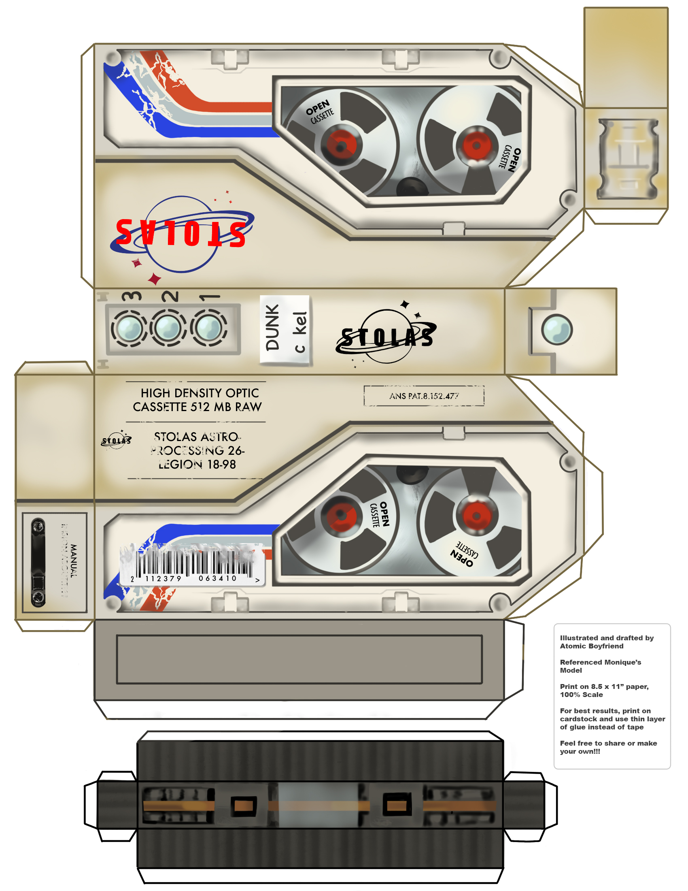

# VOTV Drive Project

- [VOTV Drive Project](#votv-drive-project)
- [Linked Research](#linked-research)
- [Overview](#overview)
- [Specifications](#specifications)
- [Plan](#plan)
  - [Dimensions](#dimensions)
  - [Memory](#memory)
  - [LEDs](#leds)
  - [Battery](#battery)
  - [Main Connector](#main-connector)
  - [USB-C PC](#usb-c-pc)
  - [Motor](#motor)

# Linked Research
- [EEPROM](/Research/Memory_and_Storage/EEPROM/README.md)
- [NOR and NAND Flash](/Research/Memory_and_Storage/NOR_NAND_Flash/README.md)
- [Batteries](/Research/Power/Batteries/README.md)

# Overview

Want to make a [Drive](https://voicesofthevoid.wiki.gg/wiki/Drive) from [VOTV](https://mrdrnose.itch.io/votv).  
These are used ingame to store and move data/signals between different machines in the game.

There are 4 lights on the drive, 3 blue lights and a red or green light. These lights indicate the state of the signal stored on the drive.
A red light indicates that there is no signal data, this light will turn green when there is data.  
The blue lights on the top indicate what level the signal has been processed to, starting at no lights for level 0 and going up to 3 lights for level 3.

<table>
  <tr>
    <td></td>
    <td></td>
  </tr>
</table>

The drives get plugged into a few machines, here it is plugged into the processing unit, I will call this the master device. The master unit can then read or write data to the drive. 

A discord by the name of v made this image on the VOTV discord, this will be useful in creating a 3D model.

# Specifications
- Create a drive that can store a small audio file.
- Be able to set the LED colours.
- Have a battery to keep the LEDs lit.
- Have an easy way to slot the drive into a master device.
- Have a way to charge the battery using USB-C PD.
- Have the tape wheels spin when the device is plugged in.

# Plan

## Dimensions
Using the drawing provided by Atomic Boyfriend, the size of the drive is 75H 153L 26W mm.

## Memory
There are a few options for memory, but these can be split into 2 categories;   
Volatile and Non-Volatile. 

Volatile needs constant power, and there will be a battery in the drive. However long term storage like this is normally non-volatile so data isn't lost when the power runs out.

This will probably be a choice between an EEPROM or NOR flash. Will need to do some experiments to decide which is best. I am leaning towards the I2C EEPROM. 

## LEDs
I have chosen [WS2812D RGB LEDs](https://www.aliexpress.com/item/1005005871456289.html), I got the foggy surface so the LEDs are not as harsh to look at. This is a similar [datasheet](https://www.alldatasheet.com/html-pdf/1570129/WORLDSEMI/WS2812D-F5/569/1/WS2812D-F5.html), however the LED shape is not and current are slightly different to whats listed on the store page.

## Battery

There is the choice between rechargeable or non-rechargeable batteries. First I will calculate the current draw of the LEDs and the memory.

Looking at the [I2C EEPROM datasheet](https://ww1.microchip.com/downloads/en/devicedoc/21203m.pdf).
The standby current is 1uA, reading is 400uA and writing is 3mA. Writing is the most energy intensive, but the device will be in standby for the majority of the time. Assuming the device is in standby 99% of the time then the average current will probably be less than 100uA.

The biggest power draw will be the LEDs, the datasheet states that the LEDs are 20mA per colour channel. The only colours needed will be red, green and blue, so only a single colour channel will need to be used at a time. The maximum number of LEDs on at once is 4, this gives a total of 80mA at maximum brightness. The LEDs will probably not be set to the maximum brightness but the worst case should be considered.

The LEDs are the majority of the power draw so the EEPROM can be ignored. This gives a current draw of 80mA. 
I have a salvaged CR123A battery, this is a non rechargeable battery, this should be 1500mAh but Im unsure of the current charge. Assuming fully charged then it will last around 37 hours of continuous use. This rules out non rechargeable batteries.

Will go with a [503450 Li-Po](https://www.aliexpress.com/item/1005004697145807.html) as I already have this.

## Main Connector
There will be the main connector where the drive plugs into the master device, this will have data and 5V for charging the battery.

## USB-C PC
There might also be a secondary USB-C plug for charging the device separately. I will need to look at making sure that both the USB and the main connector can have power at the same time without back-feeding into each other.

## Motor
Will need some sort of motor to drive the tape wheels. I looked at small DC motors but i couldn't find any small and slow enough. 

