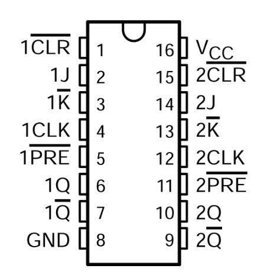
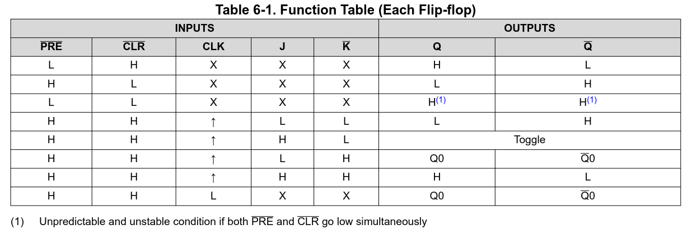
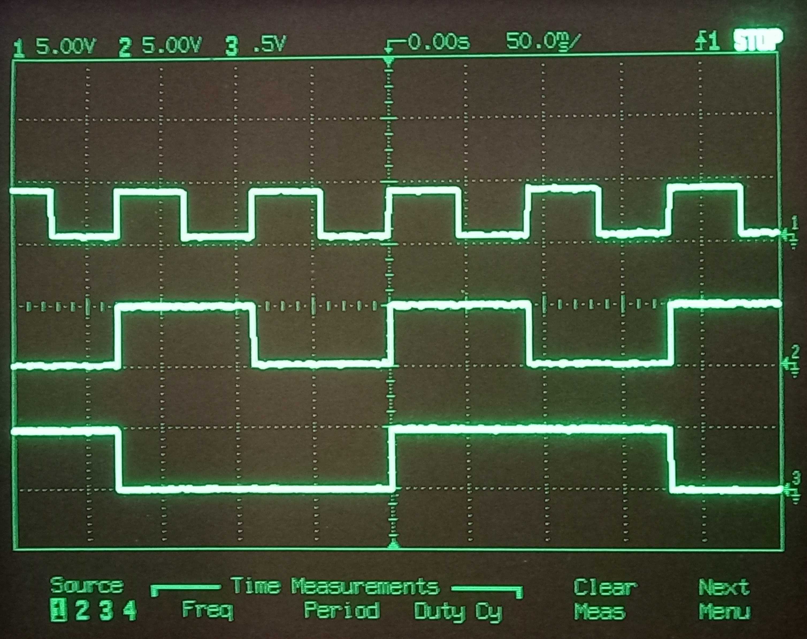
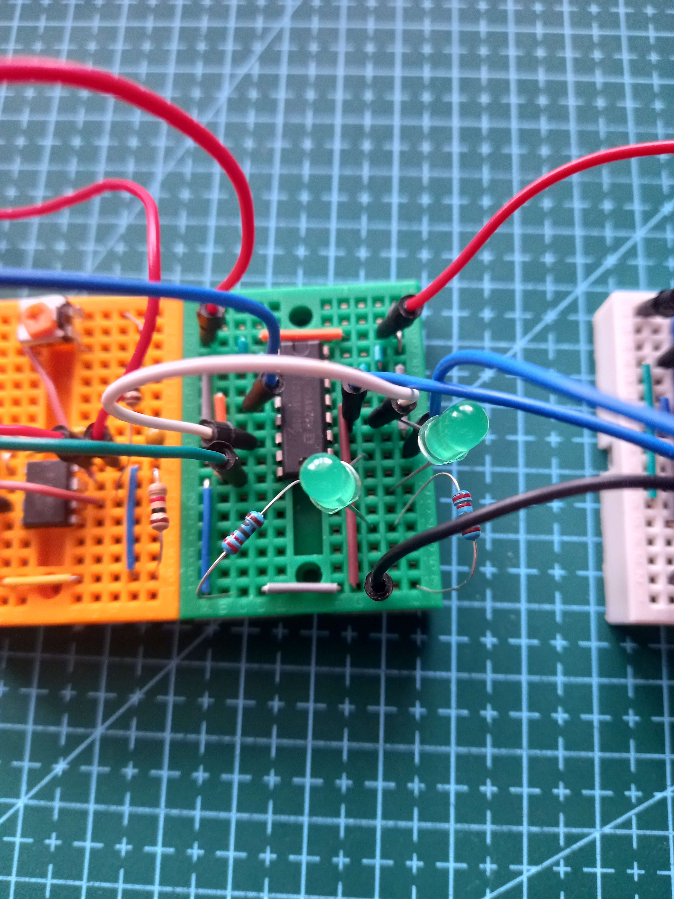

# 2Bit Ripple Counter

I will be making a full step driver, this only needs 4 states and these can be generated from a 4Bit binary counter.
I will be making a ripple counter using JK-flipflops.
[Here is a simulation](https://www.falstad.com/circuit/circuitjs.html?ctz=CQAgjCAMB0l3BWcMBMcUHYMGZIA4UA2ATmIxAUgoqoQFMBaMMAKDAUJDypRQBZwKPCF4CBkNhxH4R-EXx5zOCFgHdwGTqI1apE9WE0ipaYSj1rpZuWGIpZ4y7fvbnIvMP3g77szKGeTj4B3vbY2Jxe3A4ghALaXnExSSGJ8R5cPBlpvrEC4ZGWSQWhICUSAEqZxpzYLlIQLnAi0EgorVBQrSxVxRFlYf1UVArUw10q6rjxctOCgQZGrkZghMMsALJlkAJgQiB8wntmLSpbhpyrI0drIqcsfLZleLv7fHXznSiWc8fPrwsdOBbtgXsD1gB7DR5TqPSD2JAweCQMiEDjmTqsKFgYRJEZgeFjWDwVHoxHgFhAA), this only needs 2 flip flops and no additional circuitry. 

I will be using the [CD74AC109E](https://www.ti.com/lit/ds/symlink/cd74ac109.pdf), this is a dual package so I will only need one IC to make the counter. 
This is a positive edge triggered clock, but most examples use a negative edge triggered. This means that the counter counts down instead, this is not a problem as this will just change the direction of the motor which can be easily reversed or use the Q output instead. 

<table>
  <tr>

  </tr>
</table>

Here is the pinout and the function table for the CD74AC109E. The only output I care about is the Toggle. Both the PRE and CLR need to be tied high. Normally J and K should be tied high, but for this IC K is active low so it should be tied to ground. 

Here is the output from the binary counter, The top signal is the 555 timer clock output, followed the first and second bits of the counter. The counter is counting down as expected.  

Here is a picture of the ripple counter setup on a breadboard.

