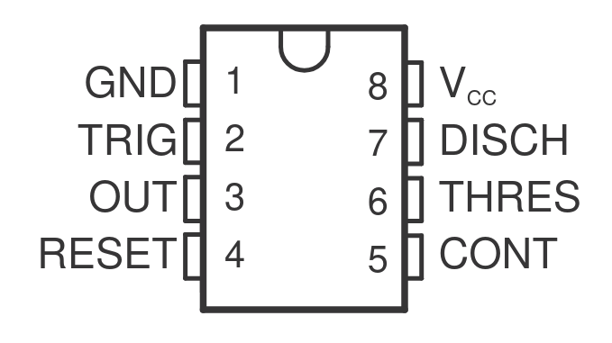
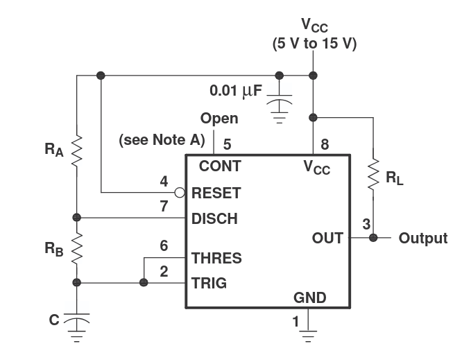
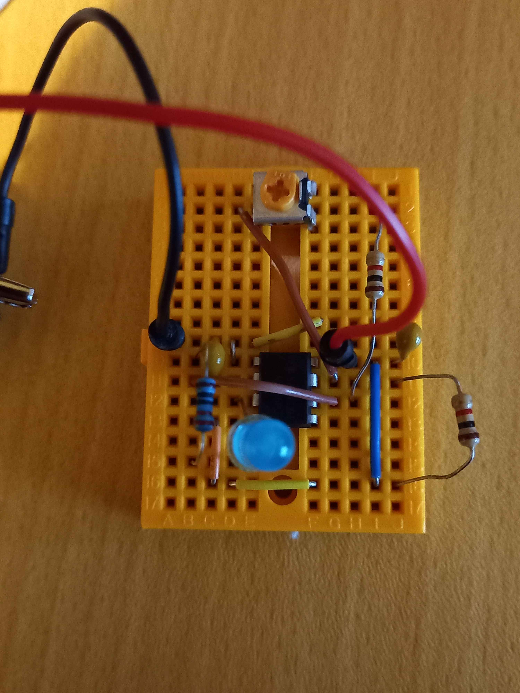
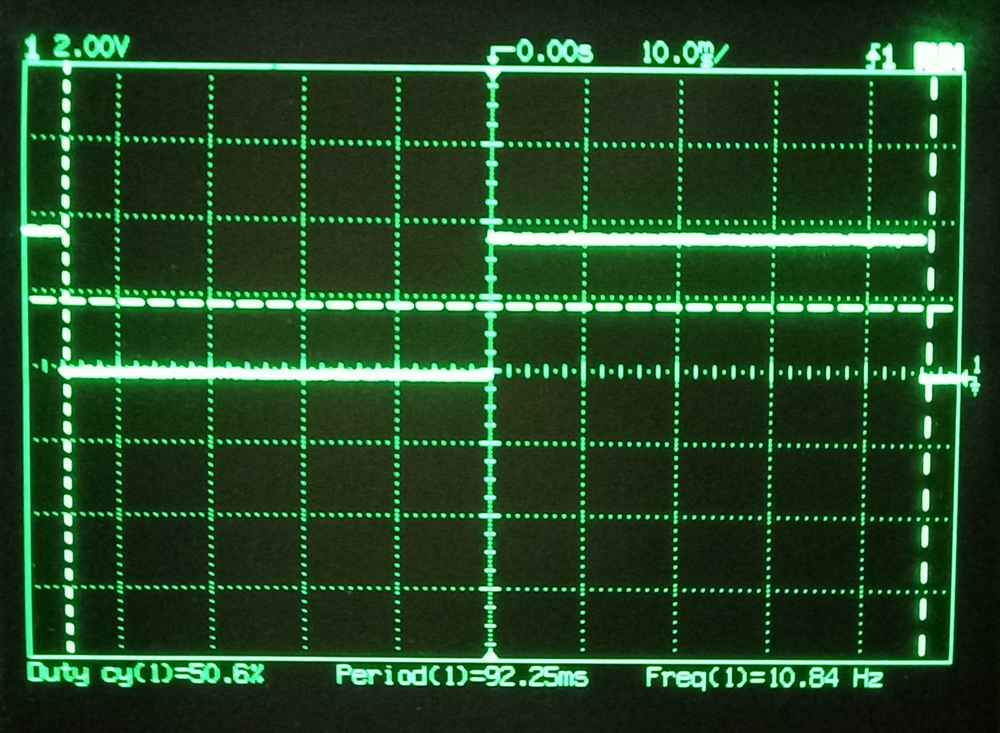
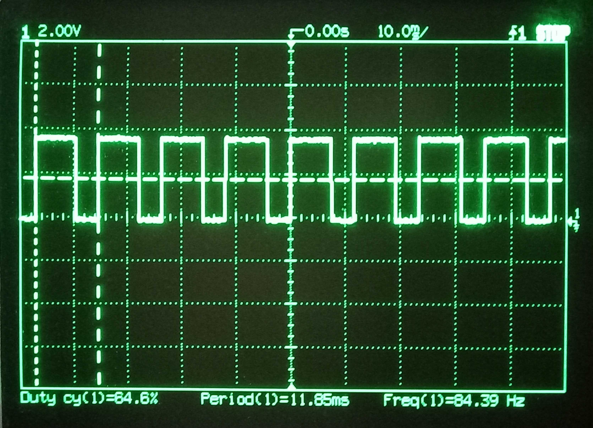
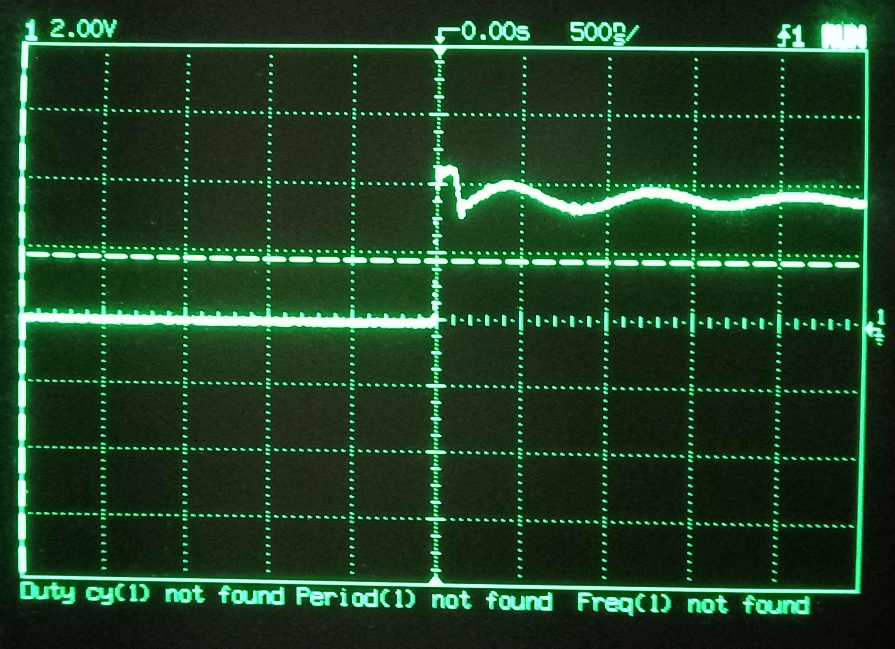
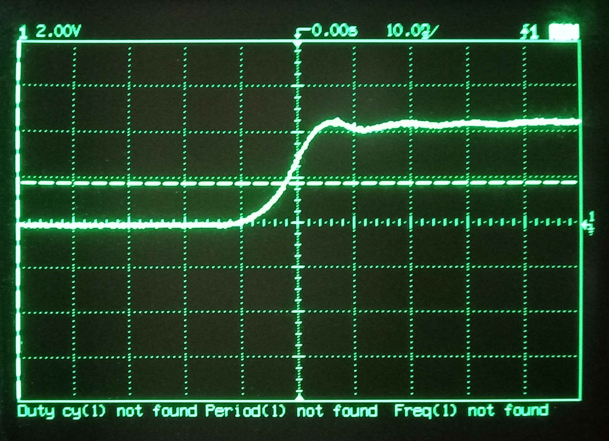

# 555 Timer
I want to make a 555 Timer circuit that generates a 32Hz clock. More information can bbe found in the [Initial research](./Initial_Research.md#555-timer-clock).

32Hz might not be the correct frequency but it will be the target for creating the 555 clock, this number might be changed after testing with the stepper motor.

I have this [555 timer](https://www.aliexpress.com/item/1005003650068859.html) ([Inventree](http://192.168.1.54/part/307/)), here is the [datasheet](https://www.ti.com/lit/ds/symlink/ne555.pdf).

Here is the pinout:

Here is the basic schematic for an astable setup, Vcc is 5V, reset should be tied high and CONT should be left floating.

The equation for the astable 555 timer is:
$$
f = \frac{1.44}{(R_A + 2R_B) \cdot C}
$$

- C=10μF
- RA=1kΩ
- RB=10kΩ potentiometer in series with 1 kΩ resistor

I initial thought this should give a range of 5 to 40Hz, but the calculation was incorrect, it should be 13 to 144 Hz. But when testing the numbers were quite off, this was partially due to the capacitor not being 10μF, it is closer to 8.6μF. The variable resistor also causes a problem because it goes to zero resistance, this basically give a 100% duty cycle which wont work. As i don't need an exact frequency the capacitance can be worked around by adjusting the pot. I will put a 1kΩ resistor in series with the pot to cap the minimum resistance of R2.

Here is a simulation that shows the expected frequency should be 55.8Hz when the pot is [0Ω](https://visual555.tardate.com/?mode=astable&r1=1&r2=1&c=8.6) and 8.0Hz when the pot is [10kΩ](https://visual555.tardate.com/?mode=astable&r1=1&r2=10&c=8.6).

Here is the circuit I have added an LED to the output to better visualise the output. It uses a 5V power supply and the output is on pin 3.

<table>
  <tr>
    
    
  </tr>
</table>

Here are the results, with the pot turned all the way anti-clockwise the frequency is lowest at 10.8Hz, all the way clockwise gives a frequency of 84H.4z. These are still a bit off the expected frequency but this is most likely due to the tolerance of the components used. 
The duty cycle remains around 50%.

<table>
  <tr>
    
    
  </tr>
</table>

I also checked if there was any bouncing or ringing, The above images shows that there is a bit of ringing but not enough to cause any problems. I have also added a 0.01μF capacitor to Vcc.

