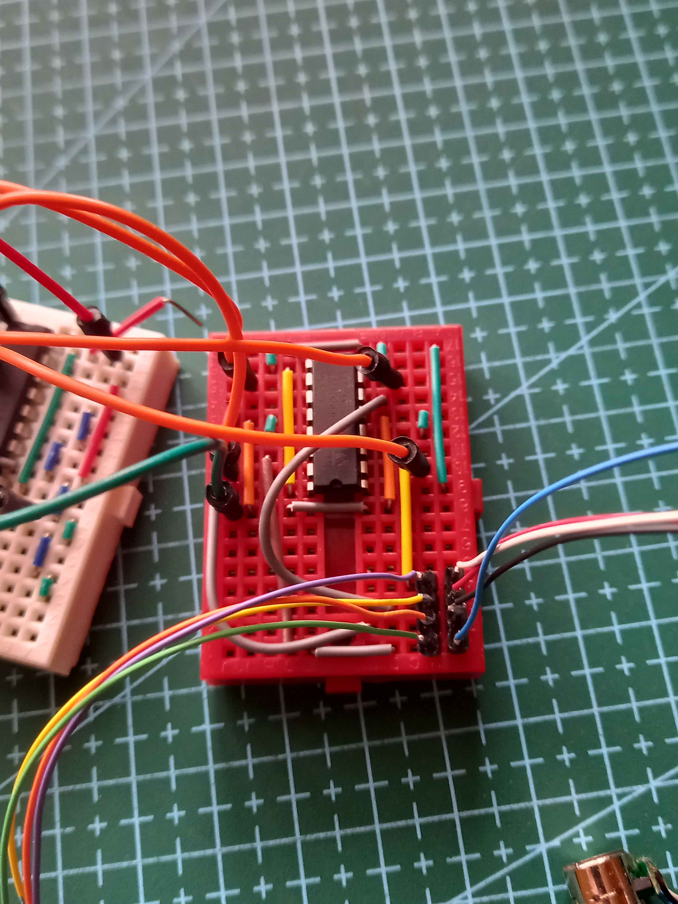
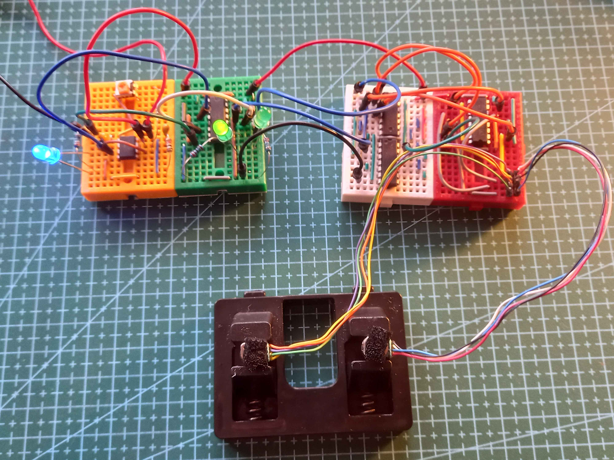
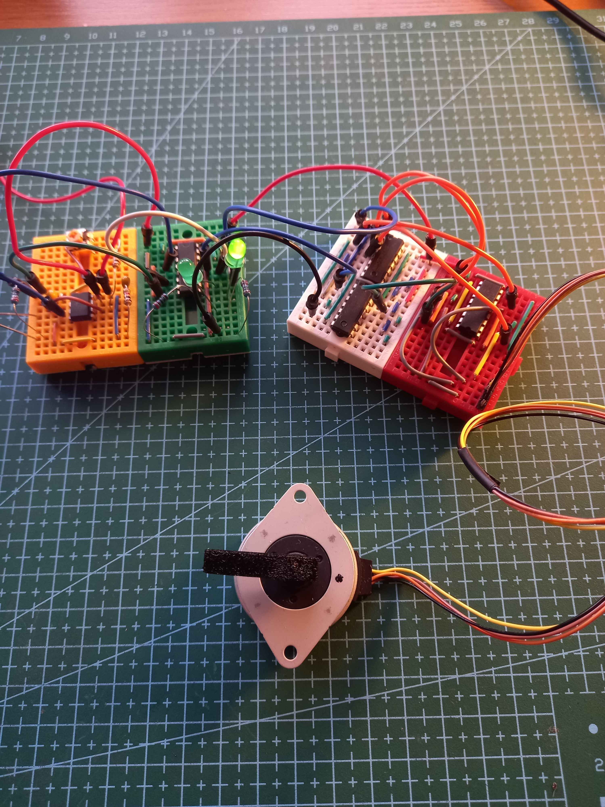
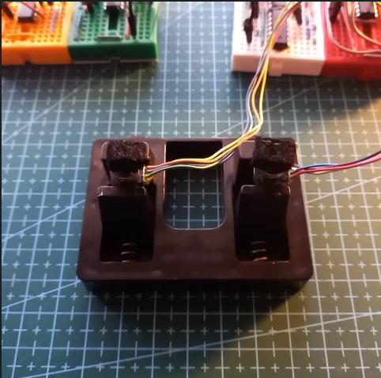

# Driving Stepper Motors

Here is the H-Bridge on a breadboard, this was tested when driving the [SP-35RC Stepper Motor](./Pancake_Stepper_Motor_(SP-35RC-810S).md).

I tested both the [SP-35RC-810S](https://www.aliexpress.com/item/1005005485719628.html) and a pair of [micro stepper motors](https://www.aliexpress.com/item/1005002698137036.html).

<table>
  <tr>
    
    
  </tr>
</table>

Here is the full setup for both stepper motors.

Here is a video of the micro steppers with the motor speed being adjusted using the trimmer pot. 

The micro steppers have an 18 deg step, so they look interesting when turning at low speeds. It almost looks like stop motion.

I found some information [here](https://makerselectronics.com/product/micro-miniature-stepper-motor-8mm-2-phase-4-wire-with-copper-gear-for-camera-lenses/) that says the motors should be driven at 3.3V but the Aliexpress listing says 5V. 
I measured the coil resistance and it was 40Ω, based off [this page](https://www.motormicro.com/product/8mm-small-stepper-motor-18step-model-08by25) I have the 08BY2540-N which is 3V. 

I used 5V when testing becaus the motor driver cant go lower than 4.5, the temperature of the motor was around 45deg which is getting a bit hot.
I will limit the resistance by putting a 20Ω resistor in series with both coils. This will reduce the current down to around 60mA.