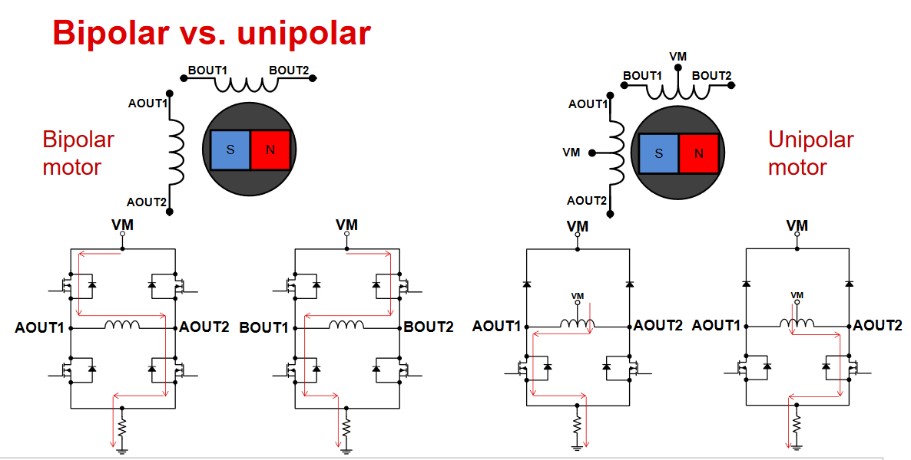
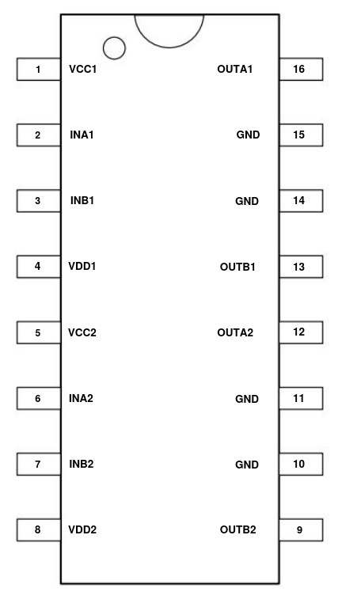
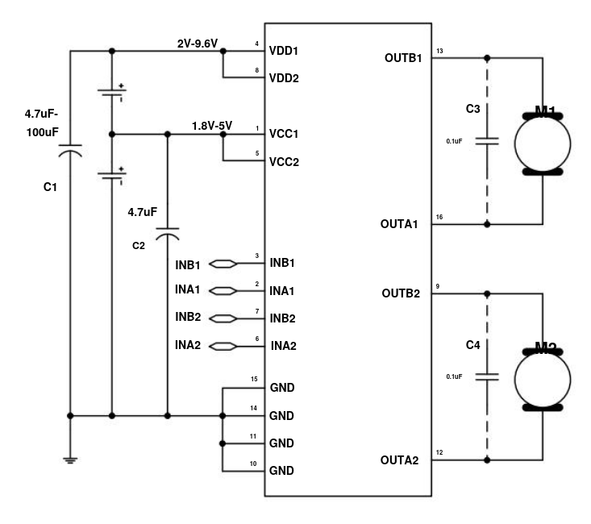
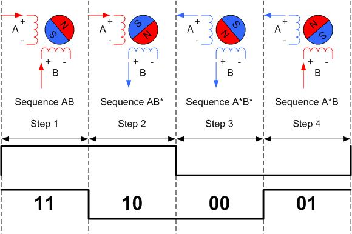
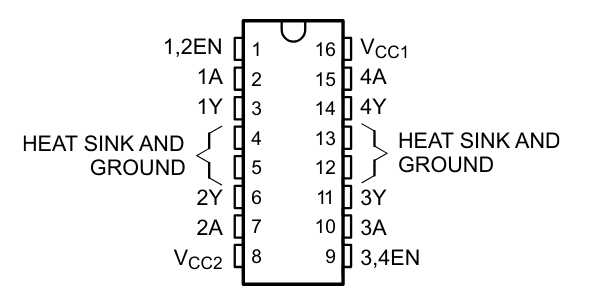
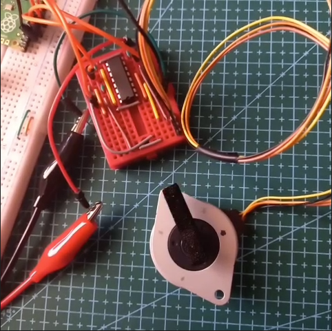

# Pancake Stepper Motor (SP-35RC-810S)

- [Pancake Stepper Motor (SP-35RC-810S)](#pancake-stepper-motor-sp-35rc-810s)
- [Useful Links](#useful-links)
- [Initial Notes](#initial-notes)
  - [Motor and Driver](#motor-and-driver)
- [Motor Stepping](#motor-stepping)
- [Issue with Stepper Driver](#issue-with-stepper-driver)
- [L293D Stepper Driver](#l293d-stepper-driver)

# Useful Links
- [Aliexpress Page](https://www.aliexpress.com/item/1005005485719628.html#nav-specification)
- [Inventree Link](http://192.168.1.54/part/304/#)
- [Datasheet (page 6)](https://moatech.com/skin/board/gallery_pdt/catalog_2016.pdf)


# Initial Notes
## Motor and Driver 
The [Datasheet (page 6)](https://moatech.com/skin/board/gallery_pdt/catalog_2016.pdf) has some information, this seems to match the [Aliexpress Listing](https://www.aliexpress.com/item/1005005485719628.html#nav-specification).


I measured a coil and the resistance was around 22.8Ω, this matches the 800s motor from the datasheet. 5V will mean a constant current of around 220mA, this is a bit above the recommended current. I will monitor the temperature to make sure that nothing is overheating. If there is problems I can put a 2.2Ω resistor on the MOSFET ground.

There are 2 types of stepper motors, Polar and Unipolar, the SP-35RC-810S motor is Bipolar. This means that 2 H-bridges are needed to drive it, 1 per coil.



I have the MX1508, I had to translate the [datasheet](./Images/MX1508_Datasheet.pdf). This is a dual channel H-Bridge/motor driver, it can handle 5V and more than 1A so it is perfect for this motor.

The logic and the motor power supplies can be different, 3.3V logic will work fine if VCC is 5V so I will just use a single 5V supply.
The pins are pretty standard for a motor driver, the pinout can be seen below.

<table>
  <tr>
    
    
  </tr>
</table>

One of the main points of confusion is the naming convention of the motor pins, sometimes a coil is labeled A-A+ and sometimes its A1A2. But the MX1508 datasheet is different again where a coil is A1B1. Probably because the MX1508 is more of a generic motor driver so it doesn't follow the stepper motor naming convention. I will use the A1A2 naming convention as its nicer to code with, the full mapping is below. 

| Code Name | Driver Name | Motor Name | Motor Colour |
|-----------|-------------|------------|--------------|
| A1        | A2          | A+         | Orange       |
| A2        | B2          | A-         | Yellow       |
| B1        | A1          | B+         | Brown        |
| B2        | B1          | B-         | Black        |

Here is the stepper motor pinout, it follows the A-A+ convention. I have cut that connector off and just soldered on pin headers for now, I will change that to a JST connector in the future.


# Motor Stepping

The step sequence for a bipolar stepper is quite simple. Both coils are energised at all times, this is a bit different to a uni polar motor where some of the coils don't need to be energised. For the bipolar motor a coil will either be energised in the positive or the negative direction. This means that A1 will always be opposite to A2. 



The pin states can be found with this simple logic, this uses an array with the bit sequence and increments the index every step.
Im using modulo to make sure that there is no index out of bounds.

``` C++ 
const bool bitSequence[4] = { 1, 1, 0, 0 };
uint8_t stepIndex = 0;

void loop() {
  bool stateA1 = bitSequence[stepIndex];
  bool stateA2 = !stateA1;
  bool stateB1 = bitSequence[(stepIndex+1)%4];
  bool stateB2 = !stateB1;

  Serial.printf("%d %d %d %d\n",stateA1, stateA2, stateB1, stateB2 );

  stepIndex++;
  stepIndex = stepIndex++%4;

} 
```
# Issue with Stepper Driver

When I connected 5V to the MX1508 it started heating up and drawing max current. After some digging I found [this post](https://www.eevblog.com/forum/projects/mx1508-versus-mx1508rx/msg5308930/#msg5308930), it seems the chip I have is the MX1508RX which is not a stepper driver. 

I have ordered some L293D H-bridges, these have a much better datasheet. Will continue testing when they arrive.

# L293D Stepper Driver
The [L293D](https://www.aliexpress.com/item/1005006751940014.html)([Inventree](http://192.168.1.54/part/312/)) stepper has arrived, Here is the [datasheet](https://www.ti.com/lit/ds/symlink/l293d.pdf?ts=1757487802724&ref_url=https%253A%252F%252Fwww.ti.com%252Fproduct%252FL293D).



Here is the pinout. Vcc1 is the power for the logic, this needs to be 5V but the logic pins will accept 3.3V inputs. Vcc2 is the power supply for the motor, this will also be 5V for this motor. Both enable pins will be tied high to enable both H-Bridges.

As this is technically a quadruple Half-H Driver, the pin names are different again.

| Code Name | Driver Name | Motor Name | Motor Colour |
|-----------|-------------|------------|--------------|
| A1        | 1A/1Y       | A+         | Orange       |
| A2        | 2A/2Y       | A-         | Yellow       |
| B1        | 3A/3Y       | B+         | Brown        |
| B2        | 4A/4Y       | B-         | Black        |

[](./Images/CD74AC109E_Stepper_Test.mp4)

Here is a video of the motor stepping at around 1Hz, I could go up to 200Hz before I started seeing problems. This speed is more than enough for what I need.
After a few minutes running the motor heated up to 30°C and the driver went up to 45°C. The motor is perfectly fine and running it directly off 5V is fine. The driver is also fine, but when I make a PCB for it I will make sure to use all the ground pins to sink the heat in to a ground plane. 
The power supply was showing an average of 220mA, this is less than I was expecting.

