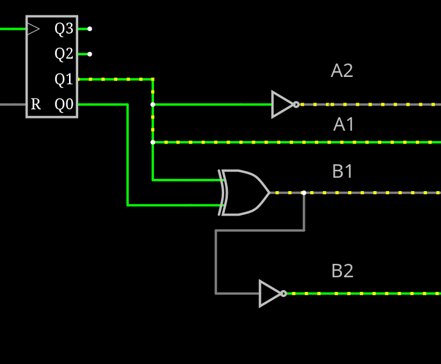

# Stepper Logic Gates

Some logic gates will be needed to convert the 2 bits from the binary counter to the 4 states needed for the 4 pins.

Here is a schematic for the 4 states. Pin 2 will always be inverse of pin 1. B1 is Q0 XOR Q1.

For A2 i could also take the Q1 output from the ripple counter flip-flop instead, but the IC I have has six channels so it doesn't const any extra to use an inverter here. The inverter will add a small delay so A1 and A2 will be a bit out of sync, but this cant be avoided on B2 without some buffers so I will just leave it. 

Here is a picture of the logic gates setup.
This worked as expected and the correct logic sequency was created.

