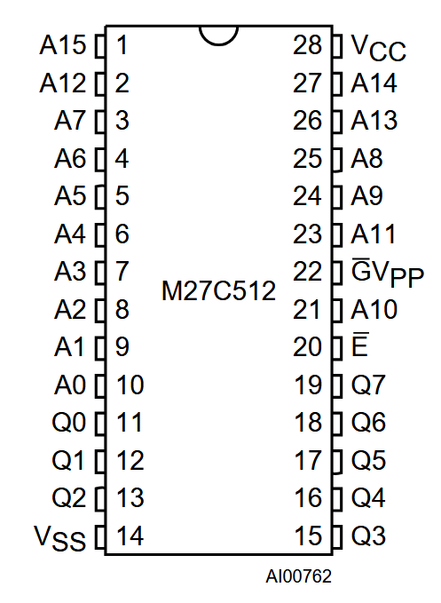
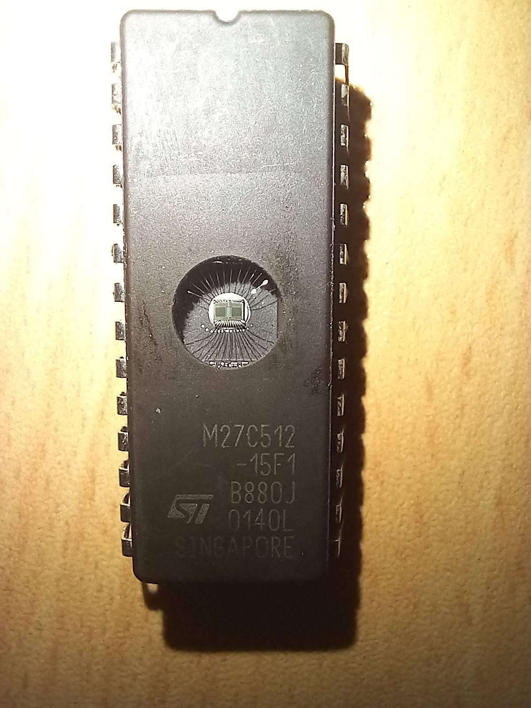
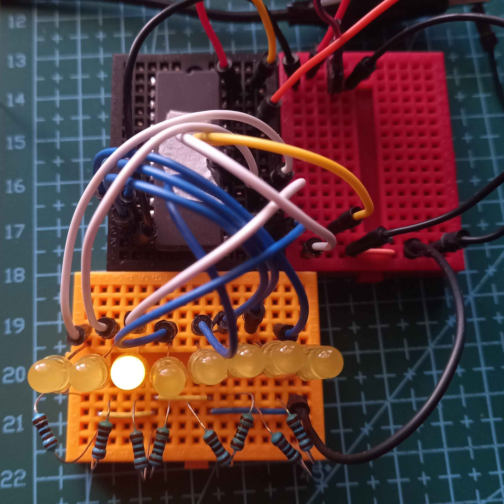
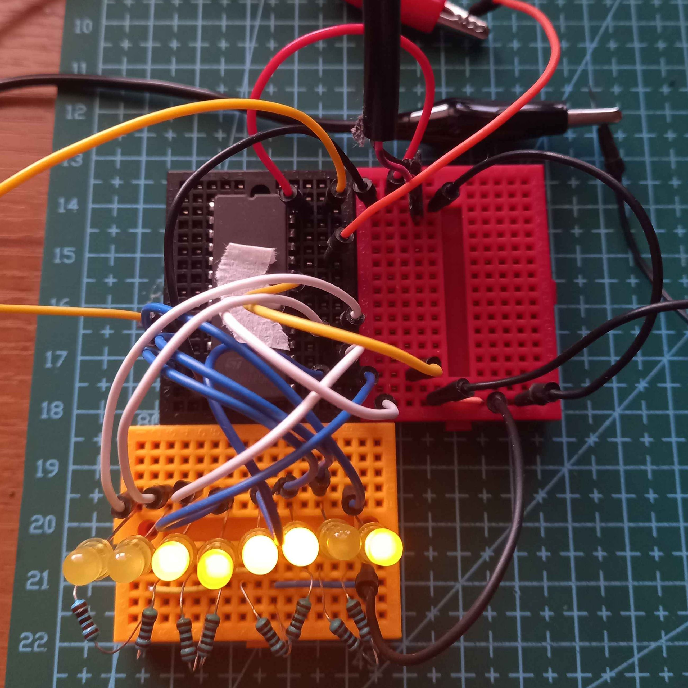

# EPROM Testing

## Useful Links
- [M27C512](https://www.aliexpress.com/item/1005009205345368.html), [Datasheet](https://media.digikey.com/pdf/data%20sheets/st%20microelectronics%20pdfs/m27c512.pdf)

## Notes
### M27C512 EPROM

First I will look at all the pins and see which will be needed.

<table>
  <tr>
    
    
  </tr>
</table>

Vcc must be 5V, There is also Vpp which should be 12.75V ± 0.25V and VID which should be 12V ± 0.5V. These voltages are not needed at the same tome so I will use 12V to get the ID then I will set the VPP voltage to 12.75.

Vcc must be added before Vpp and removed after VPP.

Chip Enable (E) is used to select the device, need to pull this low to enable or select the device.

Output Enable (G) wil;l output data to the output pins.

The EPROM uses a 16Bit address bus and an 8Bit data bus. I will probably just tie the 8MSB low for testing as 26 GPIO pins will be needed for the full address bus.

## Fist Test

Will start with reading the IDs.
- First set Vcc to 5V.
- Pull the chip enable (E) low.
- Set A9 = VID (12V.).
- Enable output by pulling G low.
- If A0 is Low then the Manufacturers Code should be 0x20. 
- If A0 is high then the Device code should be 0x3D.

This is the expected signature:

I set this up and checked some of the data pins with a multimeter. It looked like it was working, all the lower bts of the manufacturers and device code were all correct. It would be nice to have some LEDs to visually see whats on the BUS. I don't see the max current per pin in the datasheet but a 1K resistor should be around 3mA, this wont be very bright but should give a nice indication  

I set up 8 LEDs on the data bus, this showed the expected codes, so this EPROM is working correctly. 
<table>
  <tr>
    
    
  </tr>
</table>

## Retrieve Data With Microcontroller
The next test will be to connect the address and data lines to a microcontroller. 

Care needs to be taken because the EPROM is 5V and most of my microcontrollers are 3.3V.
The original plan was to use level shifters however there was some issue with them.
Instead I used a Arduino Pro Micro, this has 18 GPIO pins, this means that I cant access all the addresses, only the first 8 bits.
I will just tie the 8 MSBs to ground for now while I get the programming code ready.

### Reading Data
This is achieved with a simple for loop that increments the address then reads the data bus.

Steps for reading data:
- Set address bits
- Enable Chip
- Enable gate and wait 60ns
- Read data lines 
- Disable gate and chip

The code can be found in [Code/ReadEPROM](./Code/ReadEPROM/ReadEPROM.ino).

This loops over the lowest 256 bytes in memory and prints it out, all the data is 1 which means it has been erased. 
The next step will b to program some data onto it.

