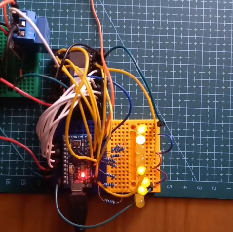

# EPROM Testing

- [EPROM Testing](#eprom-testing)
  - [Useful Links](#useful-links)
  - [Notes](#notes)
    - [M27C512 EPROM](#m27c512-eprom)
  - [First Test](#first-test)
  - [Retrieve Data With Microcontroller](#retrieve-data-with-microcontroller)
    - [Reading Data](#reading-data)
  - [Writing Data](#writing-data)
    - [Writing Data Attempt 1](#writing-data-attempt-1)
    - [Writing Data Attempt 2](#writing-data-attempt-2)
  - [Erasing data](#erasing-data)
  - [Saving a Text File](#saving-a-text-file)
  - [Conclusions](#conclusions)


## Useful Links
- [M27C512](https://www.aliexpress.com/item/1005009205345368.html), [Datasheet](https://media.digikey.com/pdf/data%20sheets/st%20microelectronics%20pdfs/m27c512.pdf)


## Notes
### M27C512 EPROM

First I will look at all the pins and see which will be needed.


<table>
  <tr>
    
    
  </tr>
</table>

Vcc must be 5V, There is also Vpp which should be 12.75V ± 0.25V and VID which should be 12V ± 0.5V. These voltages are not needed at the same tome so I will use 12V to get the ID then I will set the VPP voltage to 12.75.

Vcc must be added before Vpp and removed after VPP.

Chip Enable (<span style="text-decoration: overline;">E</span>) is used to select the device, need to pull this low to enable or select the device.

Output Enable (<span style="text-decoration: overline;">G</span>) wil;l output data to the output pins.

The EPROM uses a 16Bit address bus and an 8Bit data bus. I will probably just tie the 8MSB low for testing as 26 GPIO pins will be needed for the full address bus.

## First Test

Will start with reading the IDs.
- First set Vcc to 5V.
- Pull the chip enable (E) low.
- Set A9 = VID (12V.).
- Enable output by pulling G low.
- If A0 is Low then the Manufacturers Code should be 0x20. 
- If A0 is high then the Device code should be 0x3D.

This is the expected signature:


I set this up and checked some of the data pins with a multimeter. It looked like it was working, all the lower bts of the manufacturers and device code were all correct. It would be nice to have some LEDs to visually see whats on the BUS. I don't see the max current per pin in the datasheet but a 1K resistor should be around 3mA, this wont be very bright but should give a nice indication  

I set up 8 LEDs on the data bus, this showed the expected codes, so this EPROM is working correctly. 
<table>
  <tr>
    
    
  </tr>
</table>

## Retrieve Data With Microcontroller
The next test will be to connect the address and data lines to a microcontroller. 

Care needs to be taken because the EPROM is 5V and most of my microcontrollers are 3.3V.
The original plan was to use level shifters however there was some issue with them.
Instead I used a Arduino Pro Micro, this has 18 GPIO pins, this means that I cant access all the addresses, only the first 8 bits.
I will just tie the 8 MSBs to ground for now while I get the programming code ready.

### Reading Data
This is achieved with a simple for loop that increments the address then reads the data bus.

Steps for reading data:
- Set address bits
- Enable Chip
- Enable gate and wait 60ns
- Read data lines 
- Disable gate and chip

The code can be found in [Code/ReadEPROM](./Code/ReadEPROM/ReadEPROM.ino).

This loops over the lowest 256 bytes in memory and prints it out, all the data is 1 which means it has been erased. 
The next step will b to program some data onto it.

## Writing Data 
### Writing Data Attempt 1

Writing data is a bit more complicated because of the voltages involved:

```
VCC = 6.25V ± 0.25V
VPP = 12.75V ± 0.25V
```
I will use an adjustable power supply to create the 12.75V then use a buck converter to create the 6.25V.

The GPIO pins of the arduino pro micro are max 6V, so to be safe I will reduce the buck voltage to 6V, this is still acceptable for the EPROM.
To be extra safe I will only use the data pins to write data and will not read data. The datasheet recommends reading after every write but I will do it in chunks and will make sure to switch back to 5V when reading.

I don't have an easy way to automatically set VPP, this will be powered on at the start. Vcc will be powered on at the same time.

Steps for writing data:
- Set Chip Enable High to disable it
- Connect 6V then 12.75V to Vcc and Vpp
- Set address bits
- Set data for that address
- Pulse chip enable low for 100us
- Increment address and repeat

I only tried to set one address at first, when the EPROM is erased all the bits are 1, so I tried to set the data at address zero to `0b01010101`. Reading back the data showed that all the bits were zero.

Something is going wrong when setting the data. I think it is because of the timing of some of the signals. I was applying 12V manually and then resetting the microcontroller.


### Writing Data Attempt 2

To fix the timing issues when applying 12V I will use a relay. A P-Channel MOSFET would have been better but I don't have any at hand.

First I modified the reading code to work with the relay. As the nominally closed of the relay is tied to ground and nominally open is 5V, the logic of the code remains the same. All that is needed is a small 10ms delay after the relay pin is changed to make sure the slow relay has time to set to the correct state. 

The next step is to modify the writing code to control the gate enable pin. I will also add code to read the data after a write.

Here are the new steps for writing data:
- Power Vcc with 6.25V
- Set Chip Enable High to disable it
- 1ms delay
- Set gate enable to HIGH, this connects 12.75V to Vpp
- 10ms Delay
- Set data line as output
- Set address bits
- Set data for that address
- Pulse chip enable low for 100us
- 1ms delay
- Set gate enable to LOW
- 10ms delay
- Set data line as input
- Set Chip Enable to LOW
- 1ms delay
- Read data lines

Will only test one address first to make sure it working.
This worked well, all that needed to be changes was the data pins on the microcontroller were not set to INPUT so were conflicting with the EPROM pins when trying to read back the data.
With this fixed the value of `01010101b` was written to address 2. 

The next step is to write to all 256 address I have access to. This will just mean looping over the above steps while incrementing the address. For this test I will set the data equal to its address.

I then modified the read code to print the data in hex so it was easy to compare to the address.
Aside from the first couple of address that I messed up when testing, only one address (0x80) was corrupted. For some reason address 0x80 (128 or 0b10000000) had all its bits cleared. Im not sure what caused this to mess up, this might have happened during the initial testing when the voltage timing wasn't correct.

Here is a video of some data being programed and read back, the clicking sound is the relay thats needed for the 12V.

[](./Images/ProgramEPROM.mp4)


## Erasing data

This is done by exposing the chip to UV light. I don't have a UV light so I will use the sun. This is expected to take a week to fully erase. I will test it every few days to see it clearing.

After a day in the sun there was no change.

## Saving a Text File
The final thing I want to do is save text data to the EPROM. Due to the limited pin count with this setup I can only write 256 bits. I could create a program that stops every 256 bits and waits for the higher bits to be manually set with jumpers. Another option would be to use a 5V microcontroller with enough pins or use some sort of port expander. 

For now I will just write use the first 256 bits and leave the expansion for a future project. 
This will be done by having a char array with the text and looping over each byte. 

The code to write is found [WriteEPROM.ino](./Code/WriteEPROM/WriteEPROM.ino), this can take a string array up to 256 characters and write the data to an EPROM. This worked well, I then read back the data using [ReadEPROM.ino](./Code/ReadEPROM/ReadEPROM.ino). See [Serial.log](./Code/serial.log) for printout of the data I saved. 

## Conclusions
Interfacing with the EPROM is a pain, it needs 26 GPIO pins to access all the addresses. This is fine for a system that already has a 16bit address bus but is not practical for any modern microcontroller application.

The programming was also inconvenient because of the non higher voltages involved and the data takes at least a week in the sun to properly erase. 

But the window in the top does look cool